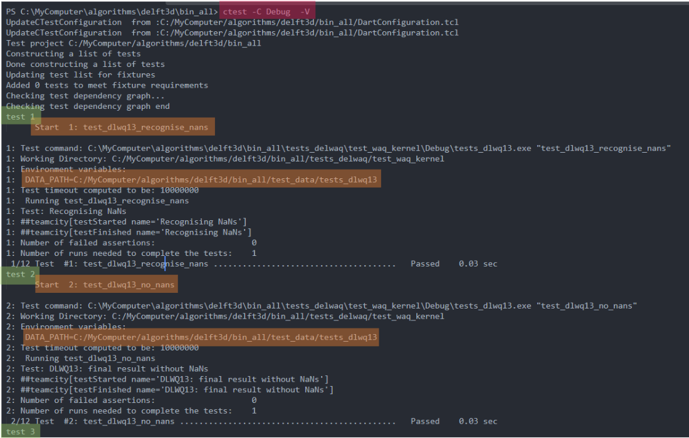
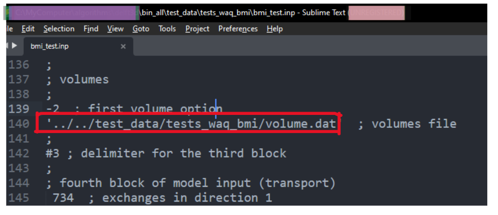

# Fortran Unit Test

## 1. Create Unit tests

### 1.1 Folder structure

- The unit tests are located in the `test/unit_test` directory. The subdirectories are structured in the
  same way as the src directory.
- To test a certain subroutine or function located in a module, create a file with the same name as the
  subroutine or function in the `test/unit_test` directory.

```
    test/unit_test/engines_gpl
    ├── engine-1
    │   ├── CMakeLists.txt
    │   ├── package-1
    │   └── package-2
    │       ├── CMakeLists.txt
    │       ├── data
    │       │   ├── file_1.txt
    │       │   └── file_2.txt
    │       ├── tests_sub_routine_1.f90
    │       └── tests_sub_routine_2.f90
    └── engine-2
        ├── package-1
        │   ├── CMakeLists.txt
        │   ├── data
        │   │   ├── file_1.txt
        │   │   └── file_2.txt
        │   ├── tests_sub_routine_1.f90
        │   └── tests_sub_routine_2.f90
        └── package-2
            ....
            └── tests_sub_routine_1.f90
```

### 1.2 Package CMakelists.txt file

- In the package folder.

```
    test/unit_test/engines_gpl
    ├── waq
    │   ├── CMakeLists.txt
    │   ├── package-1
    │   │   ├── data
    │   │   │    └── file_1.txt
    │   │   ├── CMakeLists.txt  <-------------(Here)
    │   │   ├── tests_sub_routine_1.f90
    │   │   ....
    │   ├── package-2
    │   │   ├── data
    │   │   │    └── file_1.txt
    │   │   ├── CMakeLists.txt
    │   │   ├── tests_sub_routine_1.f90
            ...
```

- Create a CMakelists.txt file that contains the following lines:

```cmake
# test dependencies
set(dependencies target1 target2 ftnunit)

create_test(
        tests_sub_routine_1
        dependencies ${dependencies}
        visual_studio_folder tests/unit_test/engines_gpl/waq/package_1
        test_files tests_sub_routine_1.f90
        include_dir ${CMAKE_CURRENT_SOURCE_DIR}/data/
        test_list test_1 test_2
)

set(dependencies target1 target2 ftnunit)

create_test(
        tests_sub_routine_2
        dependencies ${dependencies}
        visual_studio_folder tests/unit_test/engines_gpl/waq/package_1
        test_files tests_sub_routine_2.f90
        include_dir ${CMAKE_CURRENT_SOURCE_DIR}/data/
        test_list test_3 test_4
        labels "test_1:fast" "test_2:e2e"
)
```

First, define the dependencies of the test; these are the targets that are needed to build the test.
Use the `create_test` cmake function to create the test by providing the following arguments:

- The test name should include be descriptive so that it is easy to identify what is the purpose of the test and what it is
  testing. The test name does not have to contain the module name it is testing, however, can do so to be able
  to filter the tests using regex.
- The `visual_studio_folder` argument defines the folder in which the test will be located in the visual studio
  solution.
- The `test_files` argument defines the files that will be compiled to create the test.
- `test_list`: [separate multiple values/ list]
  if you have one fortran file that contains multiple tests, and you want to execute each test separately, you have to
  implement the tests in the fortran file as following.

```fortran
program test_file_1

    implicit none
    character(len = 200) :: cmd_arg
    integer :: iargc, getarg

    iargc = command_argument_count()

    if (iargc > 0) then
        call get_command_argument(1, cmd_arg)

        select case (trim(cmd_arg))
        case('test_1_name')
            write(*, *) "Running test_1_name"
            call runtests(call_test_1_subroutine)
        case ('test_2_name')
            write(*, *) "Running test_2_subroutine"
            call runtests(call_test_2_subroutine)
        case ('test_3_name')
            write(*, *) "Running test_3_subroutine"
            call runtests(call_test_3_subroutine)
        end select
    else
        write(*, *) "No test specified, running all tests"
        call runtests(call_test_1_subroutine)
        call runtests(call_test_2_subroutine)
        call runtests(call_test_3_subroutine)
    end if

contains

    ! then write the call_test_1_subroutine, call_test_2_subroutine, call_test_3_subroutine
    subroutine call_test_1_subroutine
        call test(test_1_subroutine, "some message")
    end subroutine call_test_1_subroutine

    subroutine call_test_2_subroutine
        call test(test_2_subroutine, "some message")
    end subroutine call_test_2_subroutine

    subroutine call_test_3_subroutine
        call test(test_3_subroutine, "some message")
    end subroutine call_test_3_subroutine


    subroutine test_1_subroutine()
        ! here you write your call your subroutine and error assertion statments
    end subroutine test_1_subroutine

    subroutine test_2_subroutine()
        ! here you write your call your subroutine and error assertion statments
    end subroutine test_2_subroutine

    subroutine test_3_subroutine()
        ! here you write your call your subroutine and error assertion statments
    end subroutine test_3_subroutine

end program test_file_1
```

Then in the `create_test` function use the argument `test_list` followed by the tests' names.

```cmake
 create_test(
        test_name
        dependencies ftnunit
        visual_studio_folder "tests"
        test_files test_file_1.f90 test_file_2.f90
        test_list test_1 test_2 test_3
)
```

- The `labels` argument defines the labels that could be added to the test to categorize them based on any category you
  want (speed/functionality/ specific performance metrix).

- The `labels` argument should be followed by a string of paired values "test_name:label" the first is the test name (
  should be one of the test names you gave in the test_list argument) and then a colon then any label.
```cmake
  test_files test_file_1.f90 test_file_2.f90
  test_list test_1 test_2 test_3
  labels "test_1:fast" "test_1:kernel" "test_2:medium" "test_3:e2e"
```

- The `labels` argument is an optional argument.
- You can add multiple labels for the same test.

```
    labels "test_1:fast" "test_1:kernel" "test_2:medium" "test_3:e2e"
```

- so in the `create_test` function, the argument `labels` will look as follows.

```cmake
 create_test(
        test_name
        dependencies ftnunit
        visual_studio_folder "tests"
        test_files test_file_1.f90 test_file_2.f90
        test_list test_1 test_2 test_3
        labels "test_1:fast" "test_1:kernel" "test_2:medium" "test_3:e2e"
)
```

- The `include_dir` argument defines the directory that contains the files that are needed for the test.
  The `include_dir` argument is optional, if the test does not depend on external data, the argument does not have to be
  provided.

```cmake
 create_test(
        tests_sub_routine_1
        dependencies ${dependencies}
        visual_studio_folder tests/unit_test/engines_gpl/waq/package_1
        test_files tests_sub_routine_1.f90
        include_dir ${CMAKE_CURRENT_SOURCE_DIR}/data/
        test_list test_1 test_2
)
```

### 1.3 Test Data

Put all the files that are needed for the test tn the data folder.
In the Fortran code to access the data you stored in the `data/` folder, you can use the
`get_environment_variable` function. This function will return the absolute path to the directory where the data is
during test runtime.

```fortran
program tests_sub_routine_1
    use ftnunit
    use m_dlwq13, only : dlwq13

    implicit none
    character(len = 200) :: file_path, data_path


    ! Get the DATA_PATH environment variable
    call get_environment_variable("DATA_PATH", data_path)
    file_path = trim(data_path) // '/test_data.ref'
    open (10, file = file_path)
    ! ....
end program tests_sub_routine_1
```

end program tests_waq_sub_dir_2_module_1

### 1.4 Module CMakeLists file

In the CMakeLists.txt that is in the main directory of the delft3D engine (i.e.,
waq/part/...) `test/unit_test/waq/CMakeLists.txt`.

```
    test/unit_test/engines_gpl
    ├── engine-1
    │   ├── CMakeLists.txt <------(This one)
    │   ├── package-1
    │   │   ├── CMakeLists.txt
    │   │   ....
    │   ├── package-2
    │   │   ├── CMakeLists.txt
            ...
```

Firstly, you have to insert the include statement referring to the CMakeLists.txt file where the targets/dependencies are
that you need in the test.
Secondly if you are adding tests to a package that was not tested before then use the add_subdirectory command to refer
to the sub-dir you want to test.

```cmake
if (NOT TARGET ftnunit)
    add_subdirectory(${checkout_src_root}/${ftnunit_module} ftnunit)
endif ()

# D-Waq kernel
include(${dwaq_dir}/dwaq_kernel.cmake)

# D-Waq tools
include(${dwaq_dir}/dwaq_tools.cmake)

# Here place the 
add_subdirectory(package-1 test_package_1) #package-1 refers to the name of the folder of package-1
add_subdirectory(package-2 test_package_2) #package-2 refers to the name of the folder of package-2
```

## 2. Running Unit tests

### 2.1 Windows

- Windows: After building the source code, execute ctest in the build directory. Then run ctest followed by the config.

```bash
cd build_all
ctest -C debug
```

- or you can use the `test-dir` flag to point ctest to the directory where the build is.

```bash
ctest -C debug --test-dir build_all
```

### 2.1 Linux

- Linux: After building, it is necessary to extend the $LD_LIBRARY_PATH to include the `install/lib` directory, so the
  test executables can find the compiled *.so's. Here the `build_all` indicates the directory where the source code is built (
  i.e. build_all, build_waq, etc.).

```bash
export LD_LIBRARY_PATH=/<path-where-repo-exist>/<build-dir>/install/lib:$LD_LIBRARY_PATH
ctest -C debug --test-dir build_all
```

### 2.2 Run specific test

- To run a specific test you can the flag `-R` to specify a regex pattern that matches the test name(s) you want to run.
  For example, if your test is named MyTest, you can run:

```bash
ctest -R "^MyTest$"
```

- To see the output of the tests while they are running, you can add the -V, or -VV (verbose) flag:

```bash
ctest -R MyTest -V
```



### 2.3 Labels

#### 2.3.1 Run tests with a certain label

- to run tests which have a certain label.

```bash
ctest -C Debug -L <label_1>
ctest -C Debug -L <label_1> -L <label_2> # tests with both labels
```

#### 2.3.2 Run all tests except those with a certain label

- to run all the tests that do not have a certain label.

```bash
ctest -C Debug -LE <label_1>
```

## 3. Specific Cases

### 3.1 Global Variables

- In order to test a subroutine that uses global variables, you have to export the global variable with the intel 
  directive `!DEC`, otherwise the variables will not be accessible even you have the cmake target as a dependency.

so inside your original code (model_a.f90) . 
```fortran
!DEC$ ATTRIBUTES DLLEXPORT :: global_var1, global_var2
```

and in your test code (test_model_a.f90) you can access the global variables as follows.

```fortran
use model_a_target, only : global_var1, global_var2
```
### 3.2 Paths and directories

The current work directory for any unit test is under

```bash
<build-dir>/test_delwaq/test_<engine-name>/<build-type>/<test-name>
```
and the test data that can be accessed by the `DATA_PATH` environment variable is under

```bash
<build-dir>/test_data
```
Therefore if you refere to data in your files it has to be prepended by 

```bash
../../test_data/<test-name>/<file-name>
```


